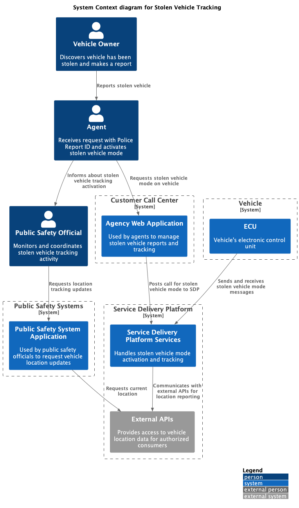
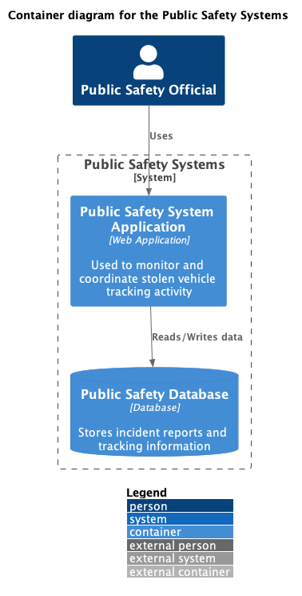
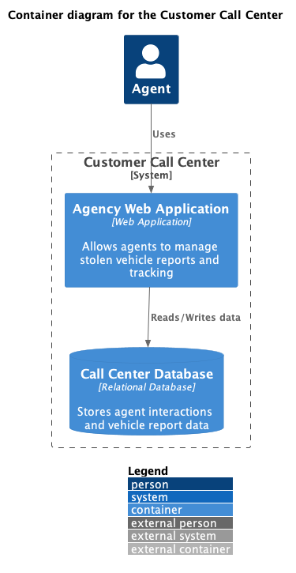
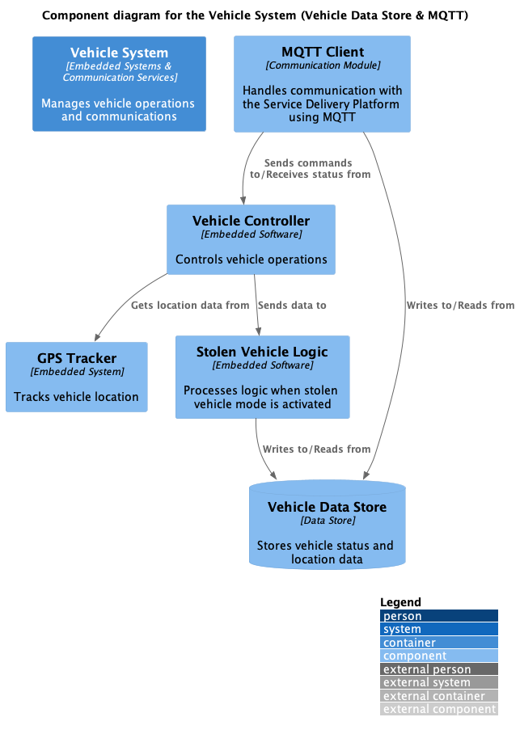
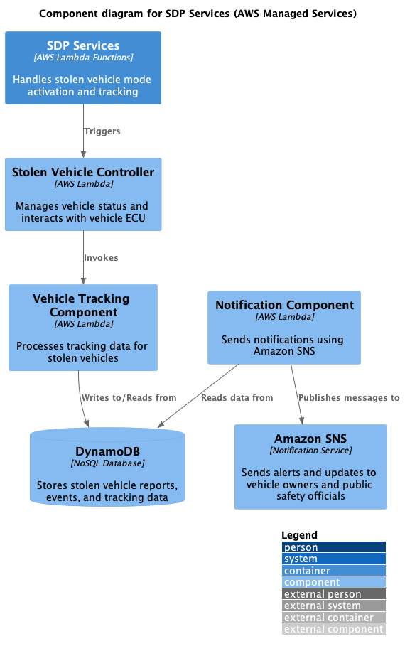

# Stolen Vehicle Tracking on AWS
Stolen Vehicle Tracking Module can acclerate the development and deployment of Stolen Vehicle Tracking Systems that integrate with Call Center and PSAP operations, for real time tracking and inhibiting of stolen vehicles. 

# System Context
This image shows the System Context for a Stolen Vehicle Tracking program 

# System Containers
The constituant containes of functionality  of each system in the context are defined in the following sections. 

## Vehicle System Containers
The general system makeup of the vehicle, within the scope is expected to look like the following: 

## Publlic Safety System Containers
The general system makeup of the Public Safety system within the scope is expected to look like the following: 

## Customer Call Center System Containers
The general system makeup of the Custoemr Call Center system within the scope is expected to look like the following:

# System Components
The components that comprise the containers for the functionlity of the system are defined in the folowing sections. Here we limit our design to the vehicle and the Service Delivery Platform as the other systems are out of scope for changes beyond API integrations. 

## Vehicle System Components
The general component makeup of the vehicle system will look as follows: 

## Service Delivery Platform 
The component makeup of the service delivery platform should look as followss: 

# Sequence Diagram Showing Work and Data Flow
This image shows the basic flow of the Stolen Vehicle tracking application

# Executable Requiremnts
This project includes executable requirements expressed through cucumber. 

They can be found in the repository 

here is an example of one of the feature files 

## Remote Inhibit Behavior Driven Development Feature File Text

**Feature**: Sending commands to limit vehicle speed or prevent ignition

**Scenario**: Agent sends command to limit vehicle speed
  Given the vehicle is in tracking mode
  When the agent sends a command to limit the vehicle's speed
  Then the vehicle should not exceed the specified speed limit

**Scenario**: Agent sends command to prevent vehicle ignition
  Given the vehicle is in tracking mode
  And the vehicle is currently not ignited
  When the agent sends a command to prevent ignition
  Then the vehicle should not start until the command is revoked

  These definitions can be generated into tests, assuring that the outcome of development meets the exepected business criteria. 

  Test