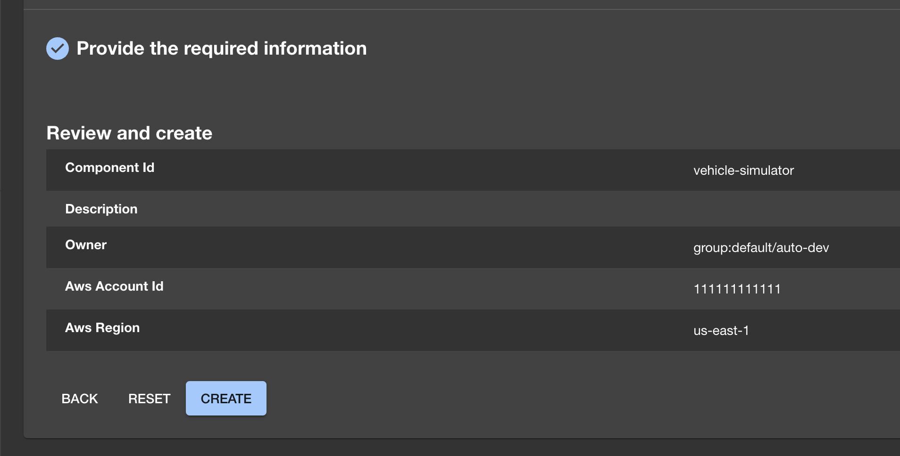

# Connected Mobility Solution on AWS

**[Connected Mobility Solution on AWS](https://aws.amazon.com/solutions/implementations/connected-mobility-solution-on-aws/)** | **[🚧 Feature request](https://github.com/aws-solutions/connected-mobility-solution-on-aws/issues/new?assignees=&labels=enhancement&template=feature_request.md&title=)** | **[🐛 Bug Report](https://github.com/aws-solutions/connected-mobility-solution-on-aws/issues/new?assignees=&labels=bug&template=bug_report.md&title=)** | **[❓ General Question](https://github.com/aws-solutions/connected-mobility-solution-on-aws/issues/new?assignees=&labels=question&template=general_question.md&title=)**

**Note**: If you want to use the solution without building from source, navigate to the [AWS Solution Page](https://solution-page.com).

<font size="5"> **If you want to jump straight into building and deploying, [click here](#build-and-deploy-the-solution)**</font>

## Table of Contents
- [Stolen Vehicle Tacking](#connected-mobility-solution-on-aws)
  - [Table of Contents](#table-of-contents)
  - [Solution Overview](#solution-overview)
  - [Architecture Diagrams](#architecture-diagrams)
    - [Solution Architecture Diagram](#solution-architecture-diagram)
    - [ACDP Architecture Diagram](#acdp-architecture-diagram)
    - [CMS Backstage Architecture Diagram](#cms-backstage-architecture-diagram)
    - [ACDP Deployment Sequence Diagram](#acdp-deployment-sequence-diagram)
    - [Module Deployment Sequence Diagram](#module-deployment-sequence-diagram)
  - [CMS Modules](#cms-modules)
    - [Environment](#environment)
  - [Build and Deploy the Solution](#build-and-deploy-the-solution)
    - [Prerequisites](#prerequisites)
    - [Required Software Dependency Versions](#required-software-dependency-versions)
    - [Clone the Repository](#clone-the-repository)
    - [Developer Environment Dependency Installations (OSX)](#developer-environment-dependency-installations-osx)
      - [Developer Environment Dependency Verifications](#developer-environment-dependency-verifications)
    - [Developer Environment Dependency Installations - Continued](#developer-environment-dependency-installations---continued)
      - [Developer Environment Dependency Verifications - Continued](#developer-environment-dependency-verifications---continued)
    - [Solution Dependency Installation](#solution-dependency-installation)
  - [Deployment Pre-Requisites](#deployment-pre-requisites)
  - [Deploy](#deploy)
    - [Create a .env file or set environment variables in the shell](#create-a-env-file-or-set-environment-variables-in-the-shell)
      - [Create .env file (preferred option)](#create-env-file-preferred-option)
      - [Set environment variables (secondary option)](#set-environment-variables-secondary-option)
    - [Verify CDK Context](#verify-cdk-context)
    - [Run CDK Bootstrap](#run-cdk-bootstrap)
    - [Upload S3 Deployment Assets (Backstage `template.yaml`s and AWS Proton service template `.tar`s)](#upload-s3-deployment-assets-backstage-templateyamls-and-aws-proton-service-template-tars)
    - [Deploy the Automotive Cloud Developer Portal](#deploy-the-automotive-cloud-developer-portal)
    - [Monitoring the Automotive Cloud Developer Portal Deployment](#monitoring-the-automotive-cloud-developer-portal-deployment)
    - [Bootstrap Proton](#bootstrap-proton)
    - [Deploy CMS Modules via Backstage](#deploy-cms-modules-via-backstage)
      - [CMS Module Deployment Order](#cms-module-deployment-order)
        - [Deployment Order of Modules with Dependencies](#deployment-order-of-modules-with-dependencies)
        - [Modules Without Dependencies](#modules-without-dependencies)
      - [Example Module Deployment via Backstage](#example-module-deployment-via-backstage)
  - [Cost scaling](#cost-scaling)
  - [Collection of Operational Metrics](#collection-of-operational-metrics)
  - [Building Open-Source Distributable](#building-open-source-distributable)
  - [Teardown](#teardown)
  - [Developer Guide](#developer-guide)
    - [Pre-Commit Hooks](#pre-commit-hooks)
    - [Unit Test](#unit-test)
  - [License](#license)

## Solution Overview

The Stolen Vehicle Tacking Module provides the code and infastructure need to track vehicle state attributes, issue remote vehicle commands and do intelligent data collection based on collection intervals or vehicle events. 

For more information and a detailed deployment guide, visit the
[Stolen Vehicle Tacking Guidance](https://aws.amazon.com/solutions/implementations/connected-mobility-solution-on-aws/)
solution page.

## Architecture Diagrams

### Solution Architecture Diagram


### Module Deployment Sequence Diagram


### Environment

For reference, there is a proton environment setup with further
details in its [README](./templates/environments/cms_environment/v1/infrastructure/README.md).


#### Example Module Deployment via Automotive Cloud Developer Portal

The following instructions detail how to deploy the CMS Vehicle Simulator Module.
The same steps can be applied to other modules as well by replacing the URLs and names.

1.	Navigate to the CMS Backstage URL in a web browser (ROUTE53_BASE_DOMAIN that was specified during deployment).
2.	Sign in to Backstage using the credentials that were emailed to the user-email specified during deployment.
3.	Follow the prompts to create a new password and set up multi-factor authentication (MFA).
4. On Backstage, navigate to the `Create` page available from the `Catalog` menu in the side bar. Select the `CHOOSE` button on the `CMS Vehicle Simulator on AWS` card.

  
5. Fill in the form as required by the Vehicle Simulator template and click the `Next Step` button.

6. Click the `Create` button.
   
7. Monitor the deployment and ensure that the Stolen Vehicle Tacking module deploys successfully.

   

## Cost scaling

Refer to the implementation guide for pricing information.

## Collection of Operational Metrics

This solution collects anonymous operational metrics to help AWS improve
the quality and features of the solution. For more information, including
how to disable this capability, please see the
[implementation guide](https://docs.aws.amazon.com/solutions/latest/connected-mobility-solution-on-aws/operational-metrics.html).

## Teardown

This solution creates multiple CloudFormation deployments; both from the top level cdk deploy as well as additional stacks
from Proton and CodePipeline executions. Some resources cannot be torn down directly via the AWS Console or by using the AWS CLI.

The following commands assume the stage is `dev`, for other stages, replace `dev` with the appropriate value.

1. Capture and store the deployment UUID of the solution.

   - This is used to look for any resources not destroyed by CloudFormation after teardown completes

   ```bash
   make get-deployment-uuid
   ```

   output will be a uuidv4 string:

   ```bash
   XXXXXXXX-XXXX-XXXX-XXXX-XXXXXXXXXXXX
   ```

2. Delete CMS on AWS Modules in AWS Proton and CloudFormation that were deployed via Backstage
   1. In AWS Proton, Navigate to the `Services` view and delete any service attached to the
   `cms-environment` Environment. Wait until all services successfully delete.

      > **NOTE:** You have to click the link into the service to be able to delete it via the `Actions` dropdown

   
      - If the delete fails in AWS Proton, and the CodeBuild `cdk destroy` task shows an error in the CodeBuild logs, most likely the module attempting
        to be deleted has a dependency blocking the deletion. Continue tearing down the rest of the modules and try again.
        Refer to the AWS Proton CodeBuild logs and CloudFormation console output for additional information.
      - If the delete fails in AWS Proton, but the CloudFormation stack for the module is deleted successfully,
      most likely AWS Proton needs an additional role for account level CodeBuild.
      You will observe the following error: `AccountSettings.pipelineCodeBuildRoleArn has not been configured.`
      In this case, go to `Account Settings` and configure a role.
         > **WARNING:** Proton's UI requires a GitHub Repository connection to configure roles.  To get around this, set the roles using a CLI command.

            ```bash
            aws proton update-account-settings \
            --pipeline-codebuild-role-arn arn:aws:iam::11111111111:role/cms-dev-cmsprotonenvironmentprotoncodebuildroleXXX-XXXXXX \
            --pipeline-service-role-arn arn:aws:iam::11111111111:role/service-role/proton_role
            ```

   1. After AWS Proton shows that all services have been deleted, verify in the
      CloudFormation console that all CMS on AWS modules have been deleted, and if not, delete them.

1. Delete AWS Proton Service Templates, Environment, and Environment Templates.
      NOTE: if you wish to keep services that have been deployed via backstage, skip these steps.
   1. Navigate to the `Service Templates` view in AWS Proton and delete any CMS on AWS service templates.

      

      WARNING: If you receive the following Validation Exception: `Service template has major versions that must first be deleted.`,
      then you must run the delete command multiple times until all of the major versions have been deleted
      for the service template.

   2. Navigate to the `Environments` view and delete the `cms_environment` Environment.

      

      WARNING: If you receive the following Validation Exception:
      `Environment template has major versions that must first be deleted.`, then you must run the
      delete command multiple times until all of the major versions have been deleted for the environment template.

   3. Navigate to the `Environment Templates` view and delete the `cms_environment` Environment Template.
      

   4. Validate on the AWS Proton dashboard that all resources have been removed.
      

   5. Navigate to CloudFormation and delete the AWS Proton CodeBuild stack (AWSProton-Codebuild-#######).
      

   6. Verify that the `cms-environment` stack was removed when tearing down AWS Proton, and if not, delete it.

## License

Copyright Amazon.com, Inc. or its affiliates. All Rights Reserved.

Licensed under the Apache License, Version 2.0 (the "License").
You may not use this file except in compliance with the License.
You may obtain a copy of the License at

    http://www.apache.org/licenses/LICENSE-2.0

Unless required by applicable law or agreed to in writing, software
distributed under the License is distributed on an "AS IS" BASIS,
WITHOUT WARRANTIES OR CONDITIONS OF ANY KIND, either express or implied.
See the License for the specific language governing permissions and
limitations under the License.
